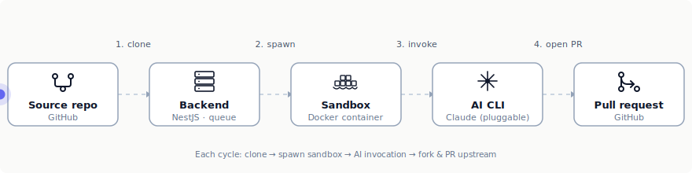

# TypeScript Coverage Improver

A NestJS + React service that finds low-coverage TypeScript files in a
GitHub repository, asks an AI CLI (Claude Code) to write or extend
`*.test.ts` files inside a sandboxed Docker container, validates the
result through three safety gates, and opens a fork-and-PR upstream.



## Demo

[](https://youtu.be/LGqJd7-IKx8)

End-to-end walkthrough: register a no-tests TS repo, watch the analyzer
populate the coverage table, click Improve on a low-coverage file, see
the per-job log stream, land on the live PR upstream. Driven against
the [`jmatom/ts-coverage-demo`](https://github.com/jmatom/ts-coverage-demo)
calculator project.

> **AI policy compliance.** Generated tests pass through three gates
> before becoming a PR: AST safety (no pre-existing test deleted or
> renamed; at least one new test added; file parses), full test-suite
> green, and a coverage-delta check (target file's line coverage
> strictly increased). On final failure the job ends `failed` with
> logs — no PR, no silent corruption.

## Run it locally

### Prerequisites

- **Docker Desktop** running, with `docker compose` v2.
- **GitHub PAT** — fine-grained or classic. See
  [docs/setup.md](docs/setup.md) for the exact scopes.
- **Anthropic API key** (`sk-ant-…`) with billing enabled.

### Boot the stack

```bash
cp .env.example .env
# Edit .env: at minimum, set GITHUB_TOKEN and ANTHROPIC_API_KEY.

docker compose up --build
```

That single command builds the per-job sandbox image, builds the
backend and frontend, and starts the backend on `:3000` and the
frontend on `:5173`.

Open **http://localhost:5173**.

### Verify clean boot

The backend logs (visible in `docker compose` output) should contain:

```
[Concurrency]      Sandbox concurrency cap: 4
[Concurrency]      AI concurrency cap: 2
[EventLoopMonitor] Event loop monitor started — warn on stalls ≥ 50ms
[AppModule]        GitHub auth OK — bot user: <your-github-login>
[AppModule]        Sandbox ready — image present, daemon reachable
[Bootstrap]        Backend listening on :3000
```

If `GitHub auth OK` or `Sandbox ready` doesn't appear, the boot
fail-fast caught a misconfiguration — read the error, fix `.env`,
rebuild. See [docs/setup.md](docs/setup.md) for common issues.

### Drive the demo

1. On the home page, paste a GitHub URL of a TypeScript repo using
   Jest, Vitest, or Mocha + c8/nyc. Click **Add**.
2. Open the repo's detail page → **Analyze** (or **Re-analyze** for
   subsequent runs). Coverage table populates.
3. Pick a low-coverage file → click **Improve**.
4. Watch the job (3-second polling). On success, the row's kebab
   menu shows **Visit PR**.

A demo target with a clean `npm install` + Jest is at
[github.com/jmatom/ts-coverage-demo](https://github.com/jmatom/ts-coverage-demo).
A few minutes of demo costs roughly $0.10 in Anthropic credits.

## What it does

- **Backend.** NestJS + Node 24 + `node:sqlite` (no native deps).
  Strict DDD layering: `domain/` and `application/` are plain
  TypeScript with zero NestJS or concrete-library imports;
  `infrastructure/` is the only place that touches NestJS, Octokit,
  dockerode, simple-git, the TypeScript compiler API, and SQLite.
- **Sandbox.** Per-job Docker container from a pre-built image
  (`coverage-improver-sandbox:latest`) with the AI CLI baked in. Runs
  as `node` (uid 1000); workdir bind-mounted to `/workspace`; env
  injected per phase. See [docs/security.md](docs/security.md).
- **Frontend.** Vite + React + Tailwind + custom shadcn-style
  components (Radix primitives for Dialog/Tooltip/DropdownMenu).
- **AI seam.** Behind an `TestGenerator` interface; one adapter shipped
  (`ClaudeCliTestGenerator`), one example sketched
  under `backend/src/infrastructure/ai/examples/GeminiCliTestGenerator.ts`.
  Adding a new CLI is a single new file plus a registry entry.

The orchestration heart is `RunImprovementJob` — fast-fail gates
before any sandbox spawn, append-mode primary, conditional
sibling-mode fallback (only on structural failures), per-attempt
retry with the previous failure fed back into the next prompt.

## Configuration

Template at [`.env.example`](./.env.example). All values are validated
at boot — bogus inputs fail-fast with a clear error.

| Variable | Default | Purpose |
| --- | --- | --- |
| `GITHUB_TOKEN` | required | PAT for clone / fork / push / PR |
| `ANTHROPIC_API_KEY` | required when `AI_CLI=claude` | Claude API key |
| `AI_CLI` | `claude` | Selects the registered AI adapter |
| `HOST_JOB_WORKDIR_ROOT` | `/tmp/coverage-improver-jobs` | Host path for per-job workdirs (bind-mounted into both backend and sandbox) |
| `DEFAULT_COVERAGE_THRESHOLD` | `80` | Default UI threshold for "low coverage" |
| `MAX_CONCURRENT_SANDBOXES` | `4` | Cap on simultaneous sandbox containers (host-bound) |
| `MAX_CONCURRENT_AI_CALLS` | `2` | Cap on simultaneous AI invocations (account-bound) |
| `MAX_QUEUE_DEPTH` | `50` | Max active jobs system-wide; beyond this, requests get HTTP 503 |
| `EVENT_LOOP_STALL_THRESHOLD_MS` | `50` | Warn-log threshold for event-loop stalls |

The two distinct concurrency caps and the queue-depth admission
control are explained in
[docs/concurrency-and-backpressure.md](docs/concurrency-and-backpressure.md).

## Test framework support

| Framework | Detection | Coverage command |
| --- | --- | --- |
| Jest | `jest` in deps | `npx jest --coverage --coverageReporters=lcovonly` |
| Vitest | `vitest` in deps | `npx vitest run --coverage --coverage.reporter=lcovonly` |
| Mocha + c8/nyc | `mocha` + `c8` (or `nyc`) in deps | `npx <c8\|nyc> --reporter=lcovonly mocha` |

If the project's `scripts.test` already wraps coverage, the runner
uses it verbatim. Other frameworks (AVA, tap, …) → friendly
`UnsupportedTestFrameworkError` at analyze time. Detection logic and
the runtime data flow are in
[docs/coverage-detection.md](docs/coverage-detection.md).

## Tests

```bash
cd backend
npm test                                 # 118 tests across 17 suites
npm test -- --testPathPattern='unit'     # skip live DockerSandbox integration tests
```

Coverage spans domain invariants and state machines, lcov parsing,
framework detection, AST validation, SQLite round-trips, queue
serialization, semaphore FIFO behavior, secret-leak detection,
agent-config scrubbing, and the orchestrator's full retry/fallback
logic against mocked ports.

## Documentation

| Topic | Doc |
| --- | --- |
| Setup details — PAT scopes, troubleshooting, local dev without Docker | [docs/setup.md](docs/setup.md) |
| Runtime topology — containers, channels, request lifecycle, when sandboxes spawn | [docs/runtime-topology.md](docs/runtime-topology.md) |
| Concurrency caps + admission control + the no-worker-threads decision | [docs/concurrency-and-backpressure.md](docs/concurrency-and-backpressure.md) |
| Security — env-var isolation, workdir scoping, prompt-injection mitigations | [docs/security.md](docs/security.md) |
| Test-runner detection + coverage calculation | [docs/coverage-detection.md](docs/coverage-detection.md) |
| Architecture — system diagram + request-flow sequence | [docs/architecture.md](docs/architecture.md) |
| Domain glossary | [docs/domain-glossary.md](docs/domain-glossary.md) |
| Design notes — end-to-end design rationale and trade-offs | [docs/design-notes.md](docs/design-notes.md) |

## License

UNLICENSED — assignment submission only.
