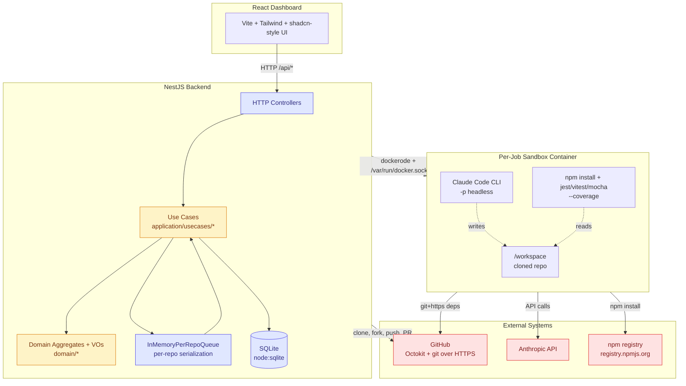
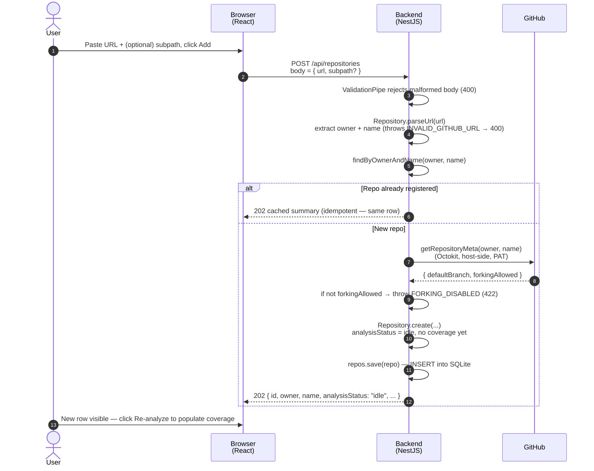
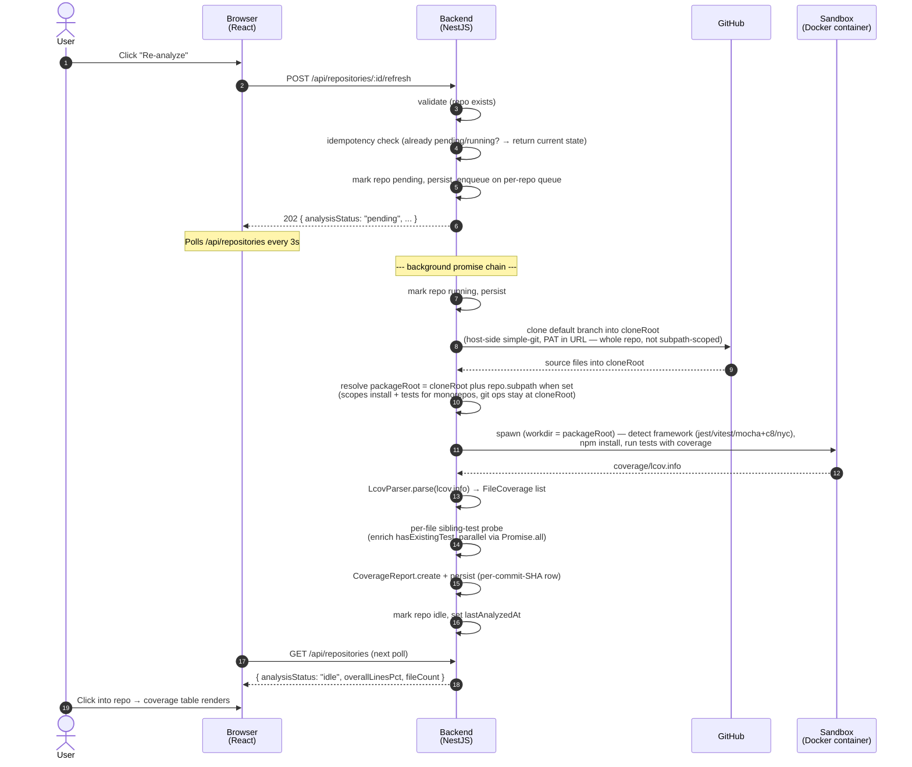
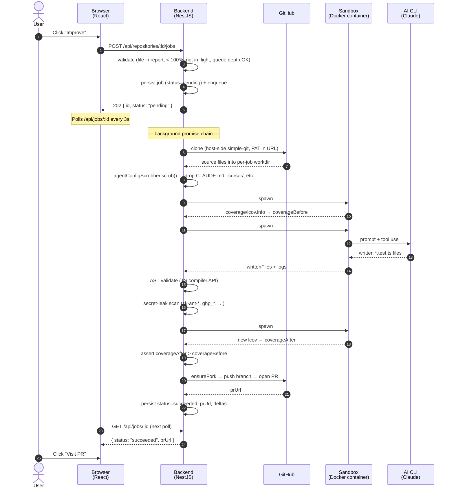

# Architecture

Two views of the same system. The **system diagram** shows the
structural layering — what code lives where, what each component
owns. The **sequence diagrams** below show the temporal lifecycles
of the three end-to-end flows: registering a repo, analyzing its
coverage, and running an improvement job.

For the deeper "where is each container, who talks to whom" view,
see [`runtime-topology.md`](./runtime-topology.md).

## System diagram

The yellow nodes (`Domain`, `Use Cases`) contain **zero** NestJS or
concrete-library imports. Only the purple infrastructure nodes import
NestJS, Octokit, dockerode, simple-git, the TS compiler API, and
`node:sqlite`. Cross-layer calls go through ports (interfaces in
`domain/ports/`).

## Register-repository sequence

Adding a new GitHub repo to the dashboard. This is the simplest of the
three flows — no per-repo queue, no sandbox container, no AI call. The
HTTP request is fully synchronous: by the time the response returns,
the row is in SQLite. Registration deliberately does NOT trigger an
analysis — the user clicks Re-analyze separately, which keeps add-repo
latency predictable and avoids surprise sandbox spawns.

A few callouts on the register sequence:

- **Synchronous, no background work**. Unlike Re-analyze and Improve, no per-repo queue is involved. The Octokit metadata fetch is the only network call and runs on the request thread.
- **Idempotent on (owner, name)**. Submitting the same URL twice returns the existing row — that's why the success status is 202 (request acknowledged, no new resource created on the duplicate path) rather than 201.
- **Fork-and-PR feasibility checked at registration**. If GitHub reports `forkingAllowed = false` (some private orgs disable forking), the request fails fast with 422. Better to surface this on add-repo than later when the user clicks Improve and the job fails mid-flight.
- **Subpath is captured at registration, not analysis**. Monorepo users supply the package subpath here so every later analyze + improve scopes to it without re-asking. The `Subpath` VO enforces the path-traversal guard.
- **No GitHub write yet**. Registration only reads from GitHub. The first write (fork + branch push + PR open) happens during Improve, not here.

## Analyze-flow sequence

A single Re-analyze request from click to coverage table populated.
Same three concurrency layers as the Improve flow below: HTTP
request/response (sub-second), the per-repo queue (background promise
chain that runs the clone + install + tests), and a per-analyze
sandbox container.

A few callouts on the analyze sequence:

- The HTTP response (step 6) returns *before* the clone starts. Same
  pattern as the Improve flow — clone + install + tests can take
  minutes for a real-world repo, and the dashboard observes the
  transitions via polling rather than a long-held connection.
- The per-repo queue serializes analysis against any improvement jobs
  for the same repo (both contend for the cloned workdir). Different
  repos run concurrently.
- Repository registration (`POST /api/repositories`) doesn't run
  analysis automatically; the user clicks Re-analyze when ready. This
  keeps registration latency predictable and avoids surprise sandbox
  spawns.
- On any thrown exception during the background chain, the repo
  transitions to `analysisStatus: "failed"` with the error message
  surfaced via `analysisError`. The boot reconciler resurrects rows
  stuck in `running` after a backend crash (one auto-retry, then
  hard-fail — see [`concurrency-and-backpressure.md`](./concurrency-and-backpressure.md)).
- `CoverageReport` rows are immutable and tagged with `(repositoryId, commitSha)` —
  re-analyzing the same commit produces a new row rather than mutating
  the previous one (the schema's primary key is the report's UUID, not
  the pair). The dashboard always reads the latest by `generated_at`.

## Improvement-job sequence

A single Improve job from click to merged PR. Three concurrency
layers are visible: HTTP request/response (sub-second), the
backend's per-repo queue (background promise chain that survives the
HTTP response), and per-job sandbox containers (each its own Linux
process).

A few callouts on the sequence:

- The HTTP response (step 5) returns *before* any sandbox work
  starts. The dashboard sees only HTTP; everything else is server-side
  promise-chain work.
- Each `spawn #N` is a **fresh** Docker container — `createContainer`
  → `start` → `wait` → `remove`. They share only the workdir
  bind-mount, not memory or env. The attacker's `postinstall` (in
  spawn #1) cannot read `ANTHROPIC_API_KEY` because that var is only
  injected into spawn #2's env array.
- The pre-AI `agentConfigScrubber.scrub()` and the post-AI `SecretScanner.findIn()`
  are the prompt-injection defenses described in
  [`security.md`](./security.md).
- On AST or test or coverage-delta failure, the loop retries (up to 2
  attempts per mode) with the failure reason fed back into the next
  prompt. On structural failure, append-mode falls back to
  sibling-mode. On security failure, the loop halts immediately.
- The "ensureFork → push → open PR" step uses Octokit on the host —
  no sandbox involvement.

## Source for the diagrams

- [`architecture.mmd`](./architecture.mmd) — the system flowchart
  above, in a standalone `.mmd` file for `mermaid-cli` rendering.
- The three sequence diagram sources are the `mermaid sequenceDiagram` blocks above
  (register flow, then analyze flow, then improvement-job flow).
